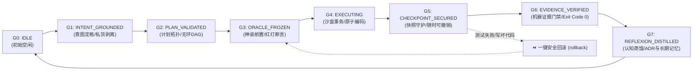

# tool-lifecycle-harness

<div align="center">

[](https://python.org)
[](https://github.com/Longgekutta/spec-cli-facade)
[](#)
[](#)
[](#)
[](LICENSE)

</div>

> **智能体七阶工程生命周期状态机与独立证据裁决门禁装具**  
> *Deterministic 7-Stage Agentic Software Engineering Lifecycle State Machine & Evidence Gate Harness*  
> **工程性状**：`Type: TOOL` | `规范: UCFS v1.0 / OMNI-PROJECT-SPEC` | `核心机制: Actor-Critic 分离 / 红灯先验 / 原子快照回滚`

---

## 💡 为什么需要 tool-lifecycle-harness？

在当前主流 AI 编码助手（Cursor, Devin, Claude Code, Antigravity）的实际运作中，往往只存在三个模糊阶段：
1. **计划 (Plan)**：由大模型在系统提示词引导下自由发挥（脑补写 Markdown）；
2. **执行 (Execute)**：大模型直接在现有代码库上盲改；
3. **检验 (Verify)**：大模型自行运行测试，或用自然语言空口宣称“我已经修复好了”。

这种传统做法存在 **4 大工程致命绝症**：
- **同义反复与补丁过拟合**：先写代码后写测试，测试用例迎合了错误代码；
- **级联破坏与脏代码**：执行中途写崩，缺乏原子回滚，越修越烂；
- **阿谀奉承 (Sycophancy)**：执行者和检验者是同一个模型，自己审自己必然放水；
- **终生失忆 (Context Amnesia)**：会话结束后所有反思与决策蒸发，下次继续踩坑。

`tool-lifecycle-harness` 彻底抹除这些缺陷，把“AI 脑内的主观臆想”替换为**“确定性的本地机器状态机与物理证据裁判门禁”**！

---

## 🏛️ 七阶确定性生命周期状态拓扑 (Seven-Stage Lifecycle)



---

## ⚡ 快速开始 (Quick Start in 3 Seconds)

本工具零外部依赖，任何智能体（Claude, Cursor, Devin, 终端）均可通过标准 CLI 驱动：

```bash
# 1. 验证运行环境 (setup)
run.ps1 setup
# 或: python main.py setup

# 2. G1: 意图定格与剥离私货 (init)
run.ps1 init "实现一个基于内存的高性能线程安全队列"

# 3. G2: 校验结构化计划无环 DAG (plan)
run.ps1 plan examples/sample_plan.json

# 4. G3: 冻结验收神谕 (检验红灯先验断言) (freeze)
run.ps1 freeze "python -m unittest tests.test_queue"

# 5. G4/G5: 创建 Git 原子快照开启安全编码 (begin)
run.ps1 begin task_1

# 6. G6: 运行独立机器证据门禁 (verify)
# 机器重放神谕指令，校验 exit code == 0 与防篡改哈希，生成 evidence_bundle.json
run.ps1 verify

# 7. 遇到代码写崩时，一键物理回滚至安全基线 (rollback)
run.ps1 rollback

# 8. G7: 结项时沉淀 ADR 决策与避坑长期记忆 (reflect)
run.ps1 reflect "采用双指针环形缓冲区代替锁" "pitfall:避免在大并发下频繁扩容"

# 9. 查看当前状态看板 (status)
run.ps1 status
```

---

## 🏛️ 全球学术源流与工业级对标 (Heritage)

| 权威源流 | 思想借鉴与吸收 |
| :--- | :--- |
| **`SWE-agent` (Princeton)** | 吸收其 ACI (Agent-Computer Interface) 专用工具设计，消除终端脆弱性 |
| **`LangGraph` (LangChain)** | 吸收状态图 (StateGraph) 确定性转移控制，严禁 AI 自行跳步 |
| **`Reflexion` (Shinn et al.)** | 吸收经验自省模型，将报错与重构沉淀为持久记忆与 ADR 决策库 |
| **`Aider` (Paul Gauthier)** | 吸收 Git Checkpoint 原子提交与一键失败回滚哲学 |
| **`Meta SapFix` / `Google Tricorder`** | 吸收独立证据门禁（Proof-or-Stop Gate），剥离工兵与裁判 |

---

## 📋 通用五动词操作契约 (UCFS Compliant)

| 动词 | 含义 | 调用方式 |
| :--- | :--- | :--- |
| **`setup`** | 检查运行环境与零依赖自检 | `python main.py setup` |
| **`run`** | 运行生命周期自检 | `python main.py run` |
| **`test`** | 运行全量单元测试套件 | `python main.py test` |
| **`health`** | 快速健康检查与退出码输出 | `python main.py health` |
| **`clean`** | 重置状态机与清理中间缓存 | `python main.py clean` |

---

## 🚫 明确非目标 (Non-Goals)

1. **不替代大模型的思考**：本工具不写业务代码，它专精于**当好状态机调度裁判**，提供不可逾越的护栏。
2. **不引入重型后台常驻 Daemon**：坚决以无状态 CLI（秒级退出）交付，零常驻内存与端口开销。
3. **不接受无客观证据的完结宣称**：禁止 AI 靠自然语言自我证明，只认 Exit Code == 0 与物理输出。
